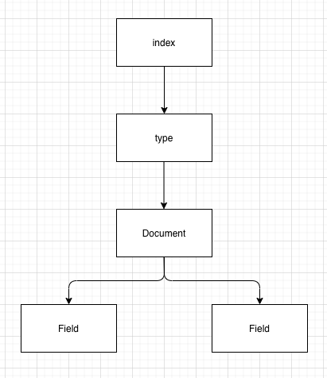

## 2장 엘라스틱서치 살펴보기


엘라스틱서치에서 사용하는 기본용어를 알아보고, 주요 API들을 살펴보기


### 엘라스틱서치를 구성하는 개념


엘라스틱치의 데이터는 인덱스, 타입, 문서, 필드 구조로 구성되어 있다.





#### 인덱스


인덱스(Index)는 데이터 저장공간이다. 하나의 타입만을 가지며, 하나의 물리적인 노드에 여러 개의 논리적인 인덱스 생성이 가능하다. 

인덱스 생성시 기본적으로 5개의 프라이머리 샤드와 1개의 레플리카 샤드 세트를 생성한다.

인덱스는 데이터 검색시에 활용되며 이름은 모두 **소문자**여야 한다. RESTful API를 통해 데이터 조작이 가능하며 인덱스가 없는 상태에서 데이터가 추가될경우 자동적으로 인덱스가 생성된다.


##### 샤딩 (sharding)

- 데이터를 분산해서 저장하는 방법
- ElasticSearch에서 스케일 아웃을 위해 index를 여러 shard로 쪼갠 것
- 작업을 여러 샤드에 분산 배치하고 병렬화 함으로써 성능/처리량을 늘릴 수 있음


##### 복제 (replica)

- 또 다른 형태의 shard라고 할수 있다.
- 노드를 손실했을 때 데이터의 신뢰성을 위해 샤드들을 복제하는것
- replica는 서로 다른 노드에 존재할 것을 권장


#### 샤드


인덱스 내부에 색인된 데이터는 물리적인 공간에 여러 개의 파티션으로 나뉘어 구성된다.

이 파티션을 **샤드 (Shard)** 라고 부른다.

샤드로 문서를 분산 저장하고 있어, 데이터 손실 위험을 최소화할 수 있다.


#### 타입


타입(Type)은 인덱스의 논리적인 구조를 의미한다. 6.0 버전 이하에서는 하나의 인덱스에 여러 타입 설정이 가능하지만 6.1 버전 부터는 불가능하다.

6.0 버전 이하에서는 타입을 특정 카테고리 분류 목적으로 사용했다.

현재는 **타입 사용을 권장하지 않기** 때문에 카테고리 별로 인덱스를 생성해야 한다.


#### 문서


문서(Document)는 **데이터가 저장되는 최소 단위**이다. (색인화 가능한 기본 단위)

기본적으로 JSON 포맷을 지원하며, 다수의 필드로 구성되어 있다.

또한 중첩 구조를 지원하기 때문에 문서 안에 문서를 지정하는 것도 가능하다.


#### 필드


필드(Field)는 문서를 구성하기 위한 속성이다. 관계형 데이터베이스의 컬럼(Column)과 비교했을때, 좀 더 동적인 데이터 타입이다.

하나의 필드는 다수의 데이터 타입을 가질수 있다.

예를 들어 제목을 검색할 때 매칭 검색과 초성 검색이 모두 지원되도록 2개의 데이터 타입을 지정할 수 있다.


#### 매핑


매핑(Mapping)은 문서의 필드 및 필드 속성을 정의하고, 색인 방법을 정의하는 프로세스이다.

매핑 정보에 필드명을 중복해서 사용할 수 없다.


> 여러 개의 도큐먼트는 하나의 타입을 이루고, 여러 개의 타입은 하나의 인덱스로 구성된다. (6.0 이하 기준)


### 엘라스틱서치 데이터 구조


엘라스틱 서치는 문서 (Document)를 인덱스로 만든 뒤, 샤드로 분리하여 관리한다.

각각의 샤드는 **루씬 인덱스** 이기도 하다.


루씬은 새로운 데이터 저장시 **세그먼트 (Segment)** 를 생성하는데, 이 세그먼트를 조합해 데이터 검색을 할 수 있다.

> 색인 (indexing) 처리량이 중요할 때는 세그먼트를 더 생성하기도 하지만, 루씬은 순차적으로 세그먼트를 검색하기 때문에 세그먼트 수가 많아질수록 검색속도도 느려지게 된다.


##### 세그먼트 (Segment)


엘라스틱서치에 새로운 데이터를 저장하면, 새로 검색가능한 세그먼트를 만들기 위해 새로운 세그먼트를 디스크에 기록하여 Refresh 한다. 

이를 **searchable segment** 라고한다.

엘라스틱서치는 세그먼트를 fsync 하는 flush를 주기적으로 진행하고 불필요한 트랜잭션 로그를 제거한다.

이를 **committed segment**라고한다.


세그먼트는 **불변성을 유지**하며, 수정이 일어났을때 삭제된 데이터 표시를 하고 새로운 데이터를 가리킨다.

오래된 삭제 데이터를 지우는 것을 **merge process** 라고 한다.


### 노드


노드는 클러스터에 포함된 단일 서버로서 데이터를 저장하고 클러스터의 색인화 및 검색기능에 참여한다.

노드는 클러스터와 동일하게 이름으로 식별되는데, 기본 값은 UUID이다.


노드는 클러스터 명을 통해 특정 클러스터로 구성될 수 있다. 기본 값은 'elasticsearch' 라는 이름의 클러스터에 포함된다.

> 네트워크에서 다수의 노드를 실행할 경우, 이 노드들은 elasticsearch라는 단일 클러스터를 형성하고 구성하게 된다.


### 노드의 종류


관계형 데이터베이스의 경우 모든 요청을 하나의 서버에서 처리하지만, 엘라스틱서치는 분산처리가 가능하기 떄문에 대용량 처리가 가능하다.

분산 처리를 위해 다양한 노드들을 조합해서 클러스터를 구성해야한다. 노드들도 각 유형이 존재하며 엘라스틱서치가 제공하는 노드 의 유형들은 다음과 같다.


#### 마스터 노드


마스터 노드는 인덱스 생성, 삭제 등 클러스터와 연관된 작업을 처리한다.

네트워크 속도가 빠르고 지연이 없는 노드를 마스터 노드로 선정해야 하며, 하나의 노드만이 마스터 노드로 선출된다.


`elasticsearch.yml 설정` 

````yaml
node.master: true
node.data: false
node.ingest: False
search.remote.connect: false
````


#### 데이터 노드


데이터 노드는 문서가 저장되는 노드이며, 샤드가 배치되는 노드이기도 하다.

색인 작업은 리소스를 많이 소모하기 때문에 마스터 노드와 분리하여 구성하는게 좋다.


`elasticsearch.yml 설정`

````yaml
node.master: false
node.data: true
node.ingest: false
search.remote.connect: false
````


#### 코디네이팅 노드


요청을 단순히 **라운드로빈** 방식으로 분산시켜 주는 노드이다.


##### 라운드 로빈 스케쥴링

- 시분할 시스템을 위해 설계된 선점형 스케쥴링 이다.
- 프로세스들 사이에 우선순위를 두지 않고, 순서대로 **시간 단위(Time Quantum/Slice)** 로 CPU를 할당하는 방식의 스케쥴링 알고리즘이다.


`elasticsearch.yml 설정`

````yaml
node.master: false
node.data: false
node.ingest: false
searc.remote.connect: false
````


#### 인제스트 노드


색인에 앞서 데이터 전처리를 위한 노드이다. 데이터 포맷을 변경하기 위해 스크립트로 전처리 파이프라인을 구성하고 실행할 수 있다.


`elasticsearch.yml 설정`

````yaml
node.master: false
node.data: false
node.ingest: true
search.remote.connect: false
````


> 각 노드들은 설정에 따라  여러 개의 유형을 겸해서 동작할 수도 있다.

